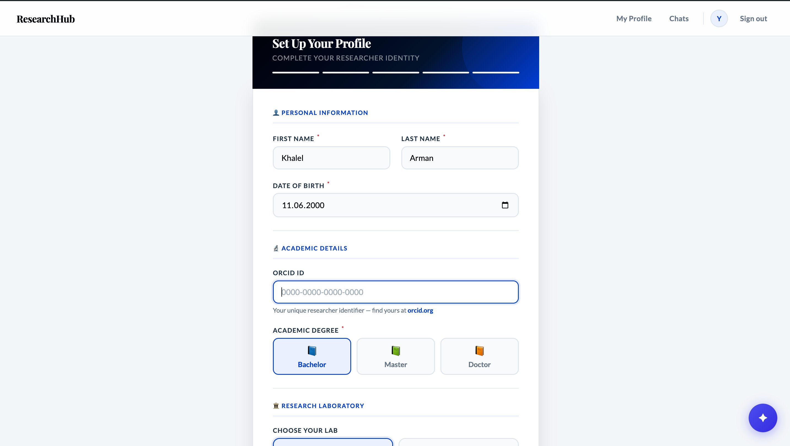
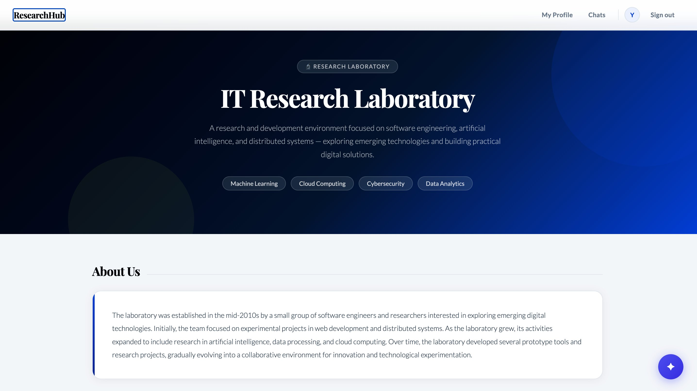
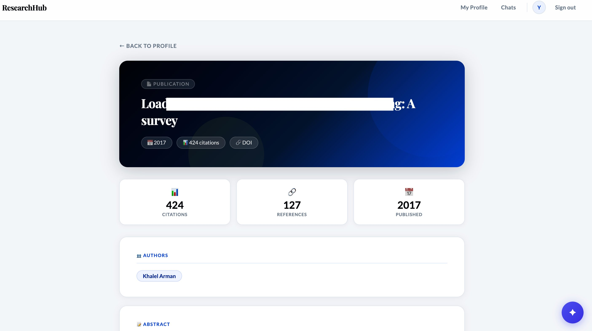
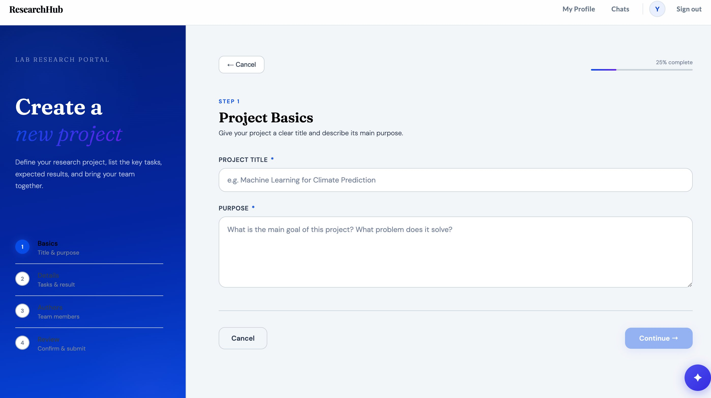
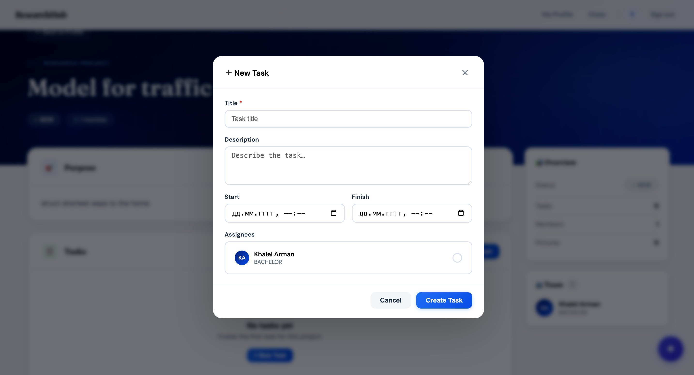
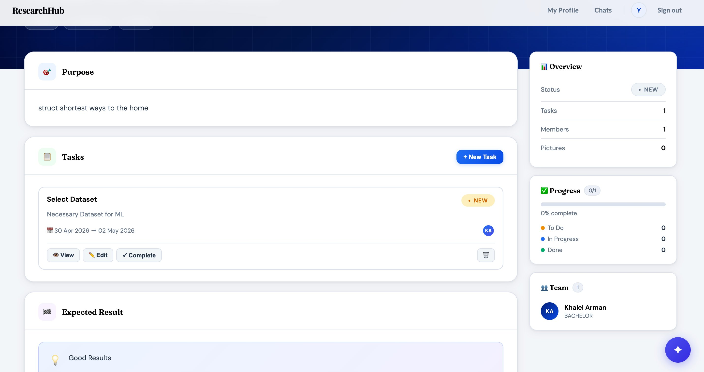
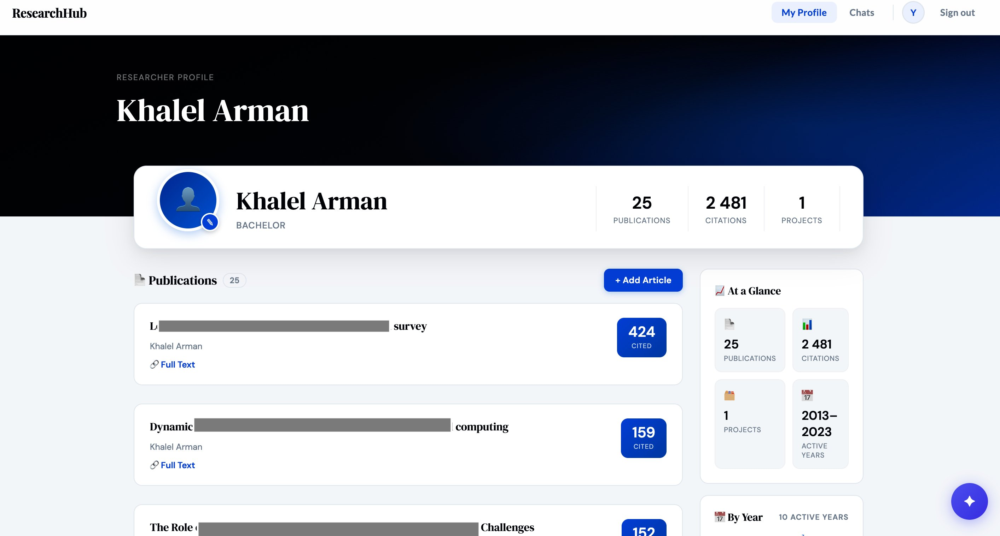
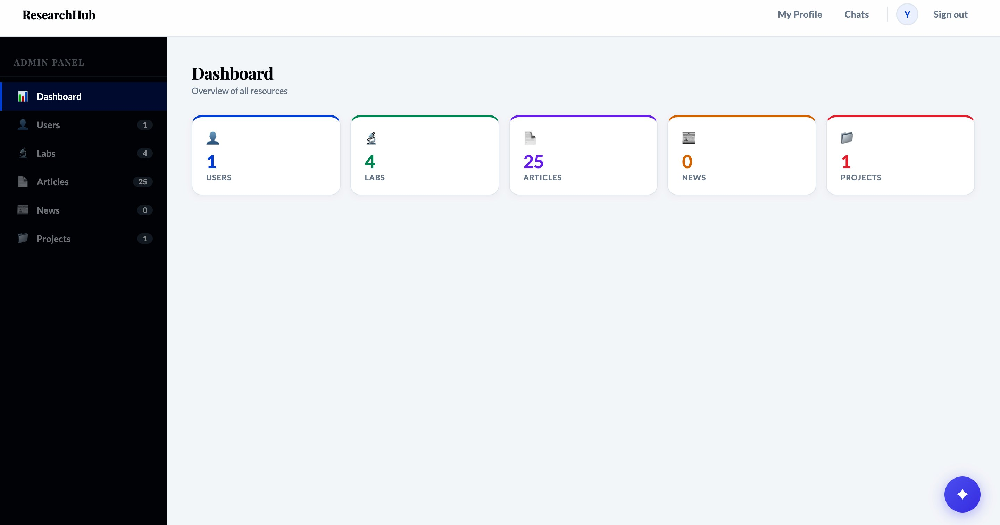
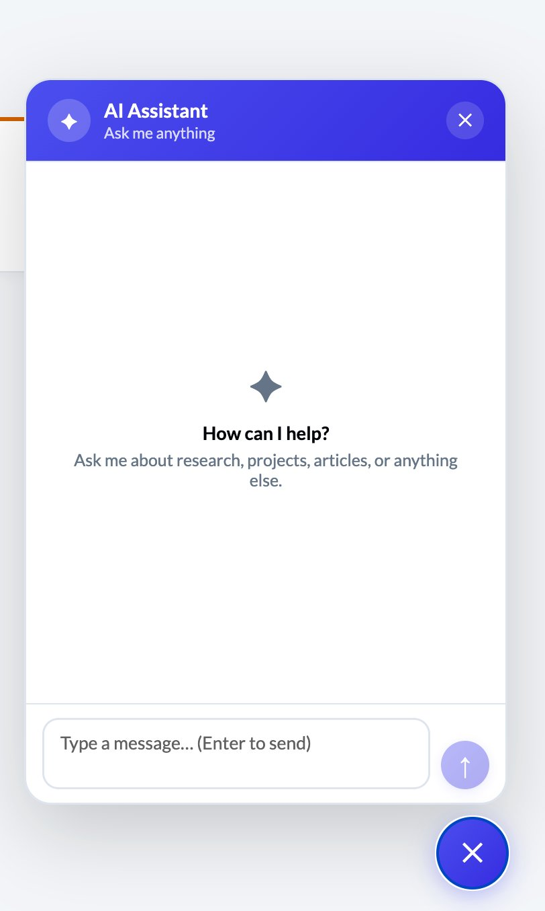
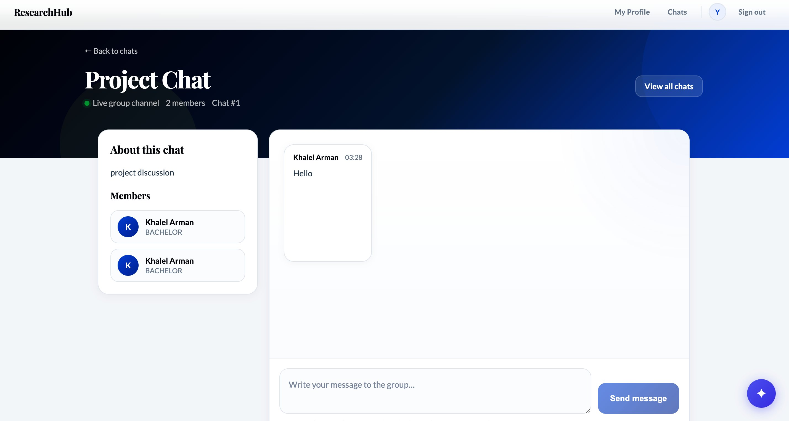

# 🔬 ResearchHub

> A full-stack academic research collaboration platform — connecting researchers, labs, publications, and projects in one unified ecosystem.

---

## 📋 Table of Contents

- [Overview](#overview)
- [Screenshots](#screenshots)
- [Architecture](#architecture)
- [Features](#features)
- [API Reference](#api-reference)
- [Tech Stack](#tech-stack)
- [Getting Started](#getting-started)

---

## Overview

**ResearchHub** is a platform built for academic researchers and laboratories. It enables researchers to manage their publication portfolios (synced from OpenAlex), collaborate on projects, communicate via real-time group chat, and get AI-assisted answers about their own research data — all under one roof.

The backend is built with **Spring Boot** using a **feature-based layered architecture**, with a separate **RAG service** for AI capabilities powered by read-only database access. Message brokering is handled by **RabbitMQ**.

---

## Screenshots

### 👤 Profile Setup
> Multi-step onboarding: personal info, ORCID ID, academic degree, lab assignment.



---

### 🏛️ Research Laboratory Page
> Lab landing page with description, research tags, and team overview.



---

### 📄 Article / Publication View
> Detailed publication card with citation count, references, year, authors, abstract, DOI, and PDF access.



---

### 🗂️ Create Project — Wizard
> 4-step project creation wizard: Basics → Details → Authors → Review.



---

### ✅ New Task Modal
> Create tasks with title, description, start/finish datetime, and assignee selection from lab members.



---

### 📊 Project Detail View
> Project dashboard with task list, progress tracker, team members sidebar, and task status management (View / Edit / Complete).



---

### 🧑‍🔬 Researcher Profile
> Public researcher profile: publications list, total citations, active years, stats at a glance.



---

### 🛡️ Admin Panel
> Admin dashboard with entity counters: Users, Labs, Articles, News, Projects. Sidebar navigation per entity type.



---

### 🤖 AI Assistant (RAG Chat)
> Floating AI assistant widget — asks questions about research, projects, and articles via RAG over the platform's database.



---

### 💬 Group Chat (HTTP Polling)
> Real-time group chat per project: member list, message history, live status indicator — implemented with HTTP long polling.



---

## Architecture

ResearchHub follows a **feature-based layered architecture** on the backend, with a decoupled RAG microservice.

```
researchhub/
├── backend/                        # Spring Boot monolith
│   ├── auth/                       # Registration, login, JWT, email verification
│   │   ├── controller/
│   │   ├── service/
│   │   ├── repository/
│   │   └── dto/
│   ├── profile/                    # Researcher profiles, avatar upload/download
│   │   ├── controller/
│   │   ├── service/
│   │   ├── repository/
│   │   └── dto/
│   ├── lab/                        # Research laboratories CRUD
│   ├── article/                    # Articles: OpenAlex sync, pageable listing
│   ├── news/                       # News CRUD
│   ├── project/                    # Projects with multi-step creation
│   ├── task/                       # Task manager: create, complete, delete
│   ├── chat/                       # HTTP polling group chat
│   ├── admin/                      # Admin panel endpoints
│   ├── messaging/                  # RabbitMQ producers & consumers
│   └── common/                     # Shared config, security, exceptions
│
├── rag-service/                    # Standalone Python/FastAPI RAG microservice
│   ├── embeddings/                 # Vector generation
│   ├── retrieval/                  # DB readonly access + semantic search
│   └── api/                       # /ai/chat endpoint
│
└── frontend/                       # React SPA
    ├── features/
    │   ├── auth/
    │   ├── profile/
    │   ├── lab/
    │   ├── article/
    │   ├── project/
    │   ├── task/
    │   ├── chat/
    │   ├── ai/
    │   └── admin/
    └── shared/
```

### Layer Structure (per feature)

```
feature/
  ├── controller/   ← HTTP layer, request/response mapping
  ├── service/      ← Business logic
  ├── repository/   ← JPA / data access
  └── dto/          ← Request & response objects
```

### RAG as a Separate Service

The AI assistant (`/ai/chat`) runs as an **independent service** with **read-only** database access. It embeds user queries, retrieves relevant context from the research database via vector similarity search, and generates grounded responses. Communication between the monolith and the RAG service goes through **RabbitMQ**.

```
Client → POST /ai/chat → Spring Boot → RabbitMQ → RAG Service → LLM → Response
                                                        ↓
                                               DB (readonly)
```

---

## Features

| Feature | Description |
|---|---|
| **Registration & Verification** | Email-based registration with verification link |
| **JWT Authentication** | Stateless auth with access tokens, long-poll login check |
| **Researcher Profiles** | Multi-step setup, ORCID, degree, lab assignment, avatar |
| **Profile Image** | Upload and download profile photos |
| **Research Labs** | CRUD for labs, member listing per lab |
| **Articles (OpenAlex)** | Fetch and store publications from OpenAlex API, pageable |
| **Article Detail** | Citations, references, authors, abstract, DOI, PDF link |
| **News** | Full CRUD for lab/platform news |
| **Projects** | Multi-step project wizard with team, tasks, expected results |
| **Task Manager** | Create, view, edit, complete, delete tasks per project |
| **Group Chat** | HTTP long-polling group chat per project |
| **AI RAG Chat** | AI assistant with read-only DB context retrieval |
| **RabbitMQ** | Message queue for async operations (first practice) |
| **Admin Panel** | Dashboard + entity management for admins |
| **Pagination** | `Pageable` support across articles, profiles, projects |

---

## API Reference

### 🔐 Auth

| Method | Endpoint | Description |
|---|---|---|
| `POST` | `/register` | Register new user |
| `GET` | `/register/verify` | Email verification |
| `POST` | `/login` | Authenticate, receive JWT |
| `GET` | `/login/{user_id}/check` | Long-poll login status check |

### 🤖 AI

| Method | Endpoint | Description |
|---|---|---|
| `POST` | `/ai/chat` | RAG-powered AI assistant query |

### 💬 Chat

| Method | Endpoint | Description |
|---|---|---|
| `POST` | `/chats` | Create new chat |
| `GET` | `/chats` | List all chats |
| `GET` | `/chats/{chatId}` | Get chat by ID |
| `POST` | `/chats/{chatId}/add` | Add member to chat |
| `GET` | `/chats/{chatId}/messages` | Get messages (polling) |
| `POST` | `/chats/{chatId}/messages` | Send message |

### 📰 Articles

| Method | Endpoint | Description |
|---|---|---|
| `GET` | `/articles` | All articles (pageable) |
| `GET` | `/labs/{lab_id}/articles` | Articles by lab |
| `GET` | `/labs/{lab_id}/articles/update` | Sync from OpenAlex |
| `GET` | `/profiles/{profile_id}/articles` | Articles by researcher |
| `GET` | `/profiles/{profileId}/articles/{articleId}` | Article detail |

### 🏛️ Labs

| Method | Endpoint | Description |
|---|---|---|
| `GET` | `/labs/{id}` | Get lab |
| `POST` | `/labs` | Create lab |
| `PUT` | `/labs/{id}` | Update lab |
| `DELETE` | `/{id}` | Delete lab |

### 📰 News

| Method | Endpoint | Description |
|---|---|---|
| `GET` | `/news/{id}` | Get news item |
| `POST` | `/news` | Create news |
| `PUT` | `/news/{id}` | Update news |
| `DELETE` | `/news/{id}` | Delete news |

### 👤 Profiles

| Method | Endpoint | Description |
|---|---|---|
| `GET` | `/profiles` | All profiles |
| `GET` | `/profiles/{id}` | Profile by ID |
| `GET` | `/profiles/search` | Search profiles |
| `GET` | `/labs/{lab_id}/profiles` | Profiles by lab |
| `POST` | `/profiles` | Create profile |
| `DELETE` | `/profiles/{id}` | Delete profile |
| `POST` | `/{id}/uploadFile` | Upload profile image |
| `GET` | `/{id}/download` | Download profile image |

### 🗂️ Projects

| Method | Endpoint | Description |
|---|---|---|
| `GET` | `/projects` | All projects |
| `GET` | `/labs/{lab_id}/projects` | Projects by lab |
| `GET` | `/profiles/{profile_id}/projects` | Projects by researcher |
| `GET` | `/profiles/{profile_id}/projects/{project_id}` | Project detail |

### ✅ Tasks

| Method | Endpoint | Description |
|---|---|---|
| `GET` | `/tasks` | All tasks |
| `GET` | `/projects/{project_id}/tasks` | Tasks by project |
| `GET` | `/profiles/{profile_id}/tasks` | Tasks by researcher |
| `GET` | `/projects/{project_id}/tasks/{task_id}` | Task detail |
| `POST` | `/projects/{project_id}/tasks` | Create task |
| `PUT` | `/projects/{project_id}/tasks/{task_id}` | Update task |
| `PATCH` | `/projects/{project_id}/tasks/{task_id}/complete` | Mark complete |
| `DELETE` | `/projects/{project_id}/tasks/{task_id}` | Delete task |

---

## Tech Stack

**Backend**
- Java 17 + Spring Boot
- Spring Security + JWT
- Spring Data JPA + PostgreSQL
- RabbitMQ (message broker)
- OpenAlex API (article sync)
- Pageable (pagination)

**RAG Service**
- Python + FastAPI
- LLM integration
- Vector embeddings
- Read-only DB access

**Frontend**
- React (feature-based structure)
- React Router
- HTTP long polling (chat)
- Axios

---

## Getting Started

```bash
# 1. Clone the repo
git clone https://github.com/your-org/researchhub.git

# 2. Configure environment
cp .env.example .env
# Set: DB_URL, JWT_SECRET, RABBITMQ_URL, OPENALEX_EMAIL

# 3. Run backend
cd backend
./mvnw spring-boot:run

# 4. Run RAG service
cd rag-service
pip install -r requirements.txt
uvicorn main:app --port 8001

# 5. Run frontend
cd frontend
npm install && npm start
```

---

> Built as a full-stack practice project covering auth, messaging, AI integration, external API sync, and layered architecture patterns.
